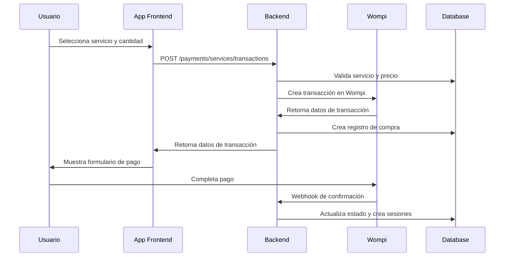
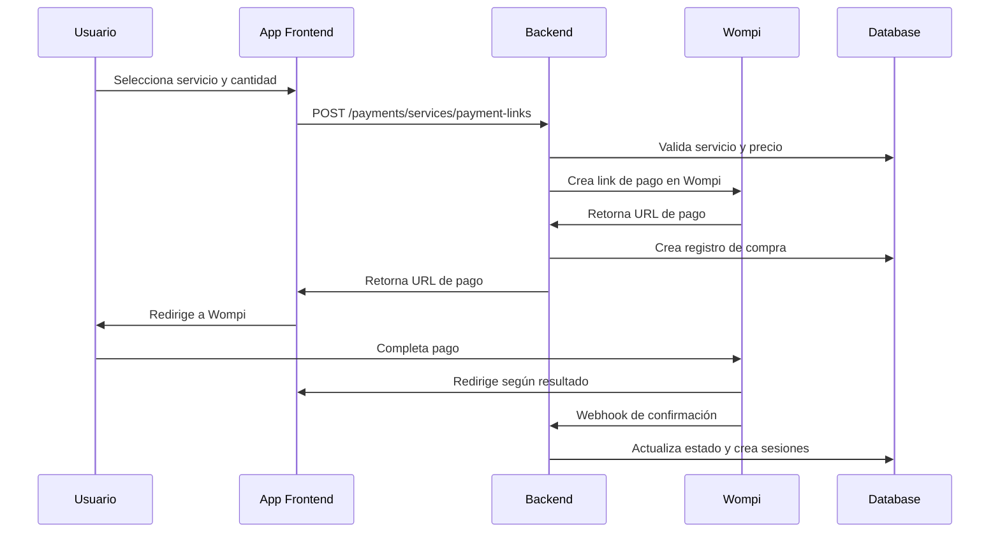

# Sistema de Pagos para Servicios Individuales

## Descripción General

Este documento describe la implementación del sistema de pagos para servicios individuales en ClinSync, que permite a los usuarios comprar sesiones de servicios específicos sin necesidad de adquirir un paquete completo.

## Características Principales

### ✅ Funcionalidades Implementadas

1. **Compra de Servicios Individuales**
   - Los usuarios pueden comprar sesiones de servicios específicos
   - Cantidad configurable de sesiones por compra (1-50)
   - Soporte para descuentos por servicio
   - Validación automática de precios

2. **Integración con Wompi**
   - Transacciones directas para servicios
   - Links de pago para servicios
   - Soporte para múltiples métodos de pago
   - Webhooks para actualización de estado

3. **Validaciones Robustas**
   - Verificación de existencia y estado activo del servicio
   - Validación de precios con tolerancia de redondeo
   - Validación de cantidad de sesiones
   - DTOs con validaciones completas

4. **Gestión de Sesiones**
   - Creación automática de sesiones de usuario
   - Fecha de expiración configurable (30 días)
   - Integración con el sistema existente de sesiones

## Endpoints Disponibles

### 1. Crear Transacción de Servicio

```http
POST /api/payments/services/transactions
Authorization: Bearer {token}
Content-Type: application/json
```

**Body:**
```json
{
  "serviceId": 1,
  "sessionsQuantity": 2,
  "amount": 150000,
  "currency": "COP",
  "paymentMethod": "CARD",
  "discountPercentage": 10,
  "customerInfo": {
    "email": "usuario@example.com",
    "fullName": "Juan Pérez",
    "phoneNumber": "+573001234567",
    "documentType": "CC",
    "documentNumber": "1234567890"
  },
  "description": "Compra de 2 sesiones de fisioterapia",
  "acceptanceToken": "acceptance_token_here",
  "acceptPersonalAuth": "personal_auth_token_here"
}
```

**Respuesta:**
```json
{
  "success": true,
  "message": "Transacción de servicio creada exitosamente",
  "data": {
    "transactionId": "txn_123456789",
    "status": "PENDING",
    "amountInCents": 15000000,
    "currency": "COP",
    "reference": "service_txn_1234567890_1_abc123"
  }
}
```

### 2. Crear Link de Pago de Servicio

```http
POST /api/payments/services/payment-links
Authorization: Bearer {token}
Content-Type: application/json
```

**Body:**
```json
{
  "serviceId": 1,
  "sessionsQuantity": 3,
  "amount": 225000,
  "currency": "COP",
  "description": "Link de pago para 3 sesiones de fisioterapia",
  "customerInfo": {
    "email": "usuario@example.com",
    "fullName": "Juan Pérez",
    "phoneNumber": "+573001234567"
  },
  "redirectUrls": {
    "success": "https://app.clinsync.com/payment/success",
    "decline": "https://app.clinsync.com/payment/decline",
    "cancel": "https://app.clinsync.com/payment/cancel"
  },
  "expiresAt": "2024-12-31T23:59:59Z",
  "paymentMethods": ["CARD", "PSE"],
  "acceptanceToken": "acceptance_token_here",
  "acceptPersonalAuth": "personal_auth_token_here"
}
```

**Respuesta:**
```json
{
  "success": true,
  "message": "Link de pago de servicio creado exitosamente",
  "data": {
    "paymentLinkId": "link_123456789",
    "paymentUrl": "https://checkout.wompi.co/l/link_123456789",
    "reference": "service_link_1234567890_1_abc123",
    "expiresAt": "2024-12-31T23:59:59Z"
  }
}
```

## Validaciones Implementadas

### 1. Validación de Servicio
- Verificación de existencia del servicio
- Validación de estado activo (`is_active = true`)
- Error 400 si el servicio no existe o está inactivo

### 2. Validación de Precio
- Cálculo automático del precio esperado: `precio_servicio × cantidad_sesiones`
- Aplicación de descuentos si se especifican
- Tolerancia de ±0.01 para diferencias de redondeo
- Error 400 si el precio no coincide

### 3. Validación de Cantidad
- Mínimo: 1 sesión
- Máximo: 50 sesiones por compra
- Debe ser un número entero positivo

### 4. Validación de Datos
- DTOs con validaciones completas usando class-validator
- Validación de formato de email, teléfono, documentos
- Validación de montos mínimos y máximos
- Validación de tokens de aceptación requeridos

## Flujo de Compra

### 1. Flujo de Transacción Directa



### 2. Flujo de Link de Pago



## Estructura de Base de Datos

### Tabla `purchases`
- `purchase_type`: 'service' para compras de servicios individuales
- `service_id`: ID del servicio comprado (nuevo campo)
- `package_id`: NULL para compras de servicios
- `sessions_quantity`: Cantidad de sesiones compradas
- `expires_at`: Fecha de expiración (30 días desde la compra)

### Tabla `user_sessions`
- Se crean automáticamente al confirmar el pago
- `sessions_remaining`: Cantidad especificada en la compra
- `expires_at`: Misma fecha que la compra
- `service_id`: ID del servicio

## Archivos Modificados

### Backend
1. **`src/modules/payment/payment.interface.ts`**
   - Agregado `CreateWompiServiceTransactionDto`

2. **`src/modules/payment/dto/payment.dto.ts`**
   - Agregado `CreateServiceTransactionDto`
   - Agregado `CreateServicePaymentLinkDto`

3. **`src/modules/payment/payment.controller.ts`**
   - Agregado `createServiceTransaction()`
   - Agregado `createServicePaymentLink()`
   - Validaciones de precio y servicio

4. **`src/modules/payment/payment.routes.ts`**
   - Rutas `/services/transactions` y `/services/payment-links`
   - Validaciones de DTO

5. **`src/modules/payment/wompi.service.ts`**
   - Modificado `createTransaction()` para soportar servicios
   - Modificado `createPaymentLink()` para soportar servicios
   - Modificado `createPurchaseRecord()` para servicios
   - Modificado `createSessionsForPurchase()` para servicios

### Tests
1. **`src/tests/test-service-payment-system.ts`**
   - Pruebas completas del sistema de servicios

2. **`src/tests/run-service-payment-tests.ts`**
   - Script para ejecutar pruebas

## Cómo Probar

### 1. Ejecutar Pruebas Automatizadas

```bash
# Desde la raíz del proyecto backend
npm run test:service-payments

# O ejecutar directamente
ts-node src/tests/run-service-payment-tests.ts
```

### 2. Pruebas Manuales con Postman/Insomnia

1. **Obtener token de autenticación:**
   ```http
   POST /api/auth/login
   {
     "email": "tu@email.com",
     "password": "tupassword"
   }
   ```

2. **Listar servicios disponibles:**
   ```http
   GET /api/services
   Authorization: Bearer {token}
   ```

3. **Crear transacción de servicio:**
   ```http
   POST /api/payments/services/transactions
   Authorization: Bearer {token}
   {body como se muestra arriba}
   ```

### 3. Verificar en Base de Datos

```sql
-- Verificar compras de servicios
SELECT * FROM purchases 
WHERE purchase_type = 'service' 
ORDER BY created_at DESC;

-- Verificar sesiones creadas
SELECT us.*, s.name as service_name 
FROM user_sessions us
JOIN services s ON us.service_id = s.service_id
WHERE us.purchase_id IN (
  SELECT purchase_id FROM purchases WHERE purchase_type = 'service'
)
ORDER BY us.created_at DESC;
```

## Consideraciones de Seguridad

1. **Validación de Precios**: Siempre se valida que el precio enviado coincida con el precio real del servicio
2. **Autenticación**: Todos los endpoints requieren autenticación JWT
3. **Validación de Entrada**: DTOs con validaciones robustas
4. **Rate Limiting**: Aplicado a endpoints de pago
5. **Logs de Auditoría**: Todas las transacciones se registran

## Próximos Pasos

1. **Frontend**: Implementar interfaces para compra de servicios
2. **Notificaciones**: Agregar notificaciones por email/WhatsApp
3. **Reportes**: Incluir servicios en reportes de ventas
4. **Descuentos**: Sistema de cupones para servicios
5. **Suscripciones**: Compras recurrentes de servicios

## Troubleshooting

### Error: "Servicio no encontrado o inactivo"
- Verificar que el `service_id` existe en la base de datos
- Verificar que `is_active = true`

### Error: "El precio no coincide"
- Verificar el cálculo: `precio_servicio × cantidad_sesiones`
- Considerar descuentos aplicados
- Verificar que no hay diferencias de redondeo > 0.01

### Error: "Usuario no autenticado"
- Verificar que el token JWT es válido
- Verificar que el header `Authorization: Bearer {token}` está presente

### Error de validación de DTO
- Verificar que todos los campos requeridos están presentes
- Verificar tipos de datos y rangos válidos
- Revisar la documentación de validaciones arriba